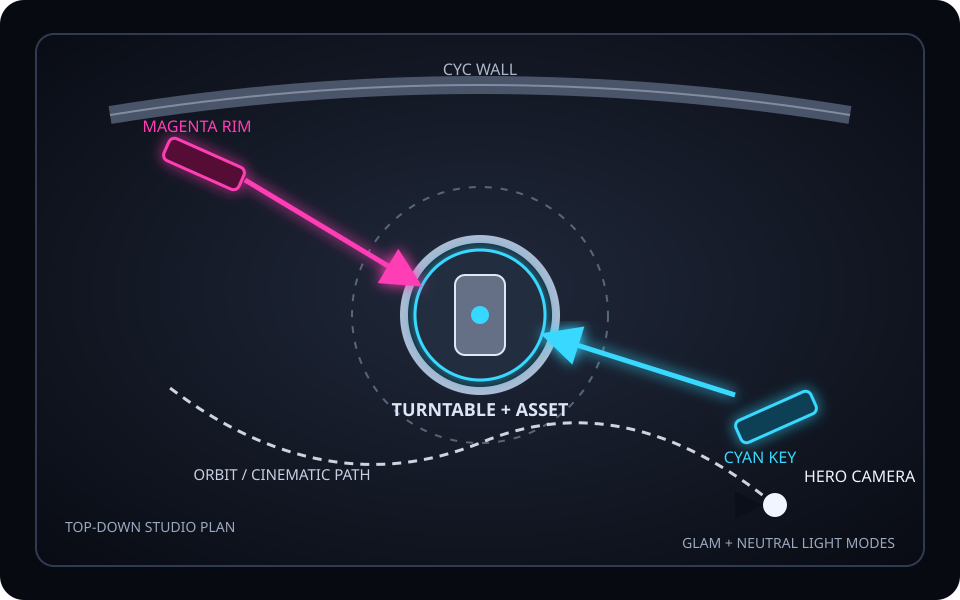

# Asset Showcase Studio

A reusable filming room for generated 3D assets. The Godot project is the fast,
interactive workflow; the included Blender generator builds a matching studio
for higher-end Eevee or Cycles renders.

## What is included

- dark cyclorama room, layered turntable, emissive practicals, contact-friendly
  asset placement, and cyan/magenta key-rim lighting;
- one-key neutral-white material inspection mode;
- toggleable textured-smooth and textured mesh-line presentation modes;
- automatic GLB/GLTF/OBJ/scene centering, grounding, and height/diameter fit;
- seven repeatable hero, inspection, detail, rear, top, and wide shots;
- orbit camera, manual free-fly camera, and a separate automated cinematic
  fly-through scene;
- clean PNG capture and fixed-frame movie recording helpers;
- a self-contained Blender studio generator with turntable, orbit, and
  fly-through animation ranges.

The Godot studio uses Forward+ by default for glow, screen-space reflections,
SSAO, TAA, and a room reflection probe. Mobile uses Godot's Mobile renderer.



## Godot quick start

1. Open this folder in Godot 4.4 or newer. Godot 4.7 is the preferred target.
2. Run the main scene.
3. Copy a model under `assets/showcase/<asset-name>/`.
4. In `scenes/showcase_studio.tscn`, select
   `Stage/Turntable/AssetSlot` and set either **Asset Scene** or
   **External Asset Path**.

The asset remains under a wrapper node. The loader merges visible
`MeshInstance3D` bounds, scales to both the stage height and diameter limits,
centers X/Z, and leaves an 8 mm turntable clearance for stable contact shadows.

For a one-off asset without editing the scene:

```bash
godot --path . -- --asset=res://assets/showcase/server_rack/server_rack.glb
```

GLB is the recommended interchange format. Export in meters, apply transforms,
use +Y up, and keep textures beside the model. Imported cameras, lights,
particles, MultiMeshes, and CSG are not used for automatic Godot bounds; static
GLB mesh hierarchies are the supported baseline.

## Controls

| Input | Action |
|---|---|
| `1`–`7` | Front, hero, right, top, detail, rear, and wide shot presets |
| Left/middle drag | Orbit the hero camera |
| Mouse wheel | Zoom |
| `Space` | Pause/resume turntable |
| `V` | Reverse turntable |
| `[` / `]` | Decrease/increase speed |
| `C` or `F` | Toggle hero and free-fly cameras |
| `R` | Reset camera and turntable angle |
| `L` | Toggle cyan/magenta glam and neutral inspection light |
| `M` | Toggle textured smooth and textured mesh-line presentation |
| `P` | Save a clean PNG; the overlay hides for the captured frame |
| `H` | Hide/show the overlay |
| RMB + mouse | Look around in free-fly mode |
| `WASD`, `Q/E`, `Shift` | Fly, descend/ascend, boost |

Mesh-line mode preserves the asset's original textured materials and applies a
subtle translucent cyan wire overlay. Existing per-mesh material overlays are
restored when returning to smooth mode. Tune `Mesh Line Color` on
`Stage/Turntable/AssetSlot`, or enable `Start With Mesh Lines` for a scene-owned
default.

PNG captures are stored under `user://showcase_captures/`. Godot prints the
absolute file path in the Output panel after every capture.

## Record a turntable or fly-through

The helper starts Godot Movie Maker with a fixed FPS, hides the HUD, stops after
an exact frame count, keeps an AVI master, and uses FFmpeg to make an H.264 MP4.

```bash
./tools/render_godot_movie.sh \
  turntable recordings/server_rack.mp4 30 1920x1080 20 \
  res://assets/showcase/server_rack/server_rack.glb

./tools/render_godot_movie.sh \
  flythrough recordings/server_rack_fly.mp4 30 3840x2160 12 \
  res://assets/showcase/server_rack/server_rack.glb
```

Set `GODOT_BIN=/absolute/path/to/godot` if the binary is not named `godot` or
`godot4`. At the default 18 degrees/second, a complete turntable revolution is
20 seconds. For repeatable footage, record from a freshly launched scene.

## Blender workflow

Run this in a new or throwaway `.blend`: the generator intentionally clears the
current file before constructing the studio.

```bash
blender --background --python tools/blender/build_showcase.py -- \
  --asset /absolute/path/to/server_rack.glb \
  --output /absolute/path/to/server_rack_showcase.blend
```

Without `--asset`, it creates a polished placeholder. The generated master has
three edit-friendly ranges:

| Frames | Shot |
|---:|---|
| 1–240 | Locked camera, rotating asset |
| 241–480 | Orbiting camera, resting asset |
| 481–660 | Cinematic fly-through |

See `tools/blender/README.md` for render engines, stills, PNG sequences, GUI
usage, and validation. Encode a sequence with:

```bash
./tools/encode_png_sequence.sh \
  'renders/turntable/frame_%04d.png' recordings/turntable.mp4 30 1
```

## Validation

Structural validation, modern GDScript grammar parsing, Python AST/compile, and
shell syntax checks pass in the build environment. Godot and Blender binaries
were not available there, so the package does not claim an engine-rendered
preview or a generated `.blend` was produced in this environment.

Run the engine-native checks after the first Godot import:

```bash
python3 tools/validate_project.py
godot --headless --editor --path . --quit
godot --headless --path . --script res://tools/headless_smoke_test.gd

blender --background /path/to/generated_showcase.blend \
  --python tools/blender/validate_showcase.py
```

The initial `--editor --quit` builds Godot's global script-class cache before
the smoke test refers to the custom `class_name` types.

## Project map

```text
scenes/showcase_studio.tscn       interactive studio
scenes/flythrough_showcase.tscn   automated cinematic shot
assets/showcase/                  drop-in model area
scripts/                          asset fit, cameras, lighting, turntable
materials/                        self-contained studio materials
tools/render_godot_movie.sh       fixed-frame Godot capture
tools/blender/                    Blender generator and validator
recordings/                       intended movie output folder
```
